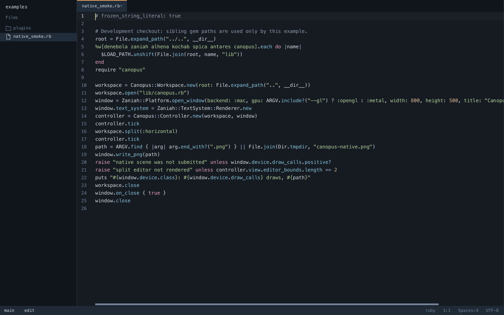

<p align="center">
  
</p>

<p align="center">
  <strong>Ruby-native code editor with GPU windows, language-server tools, a terminal, Git integration, and Vim bindings</strong>
</p>

<p align="center">
  <a href="https://rubygems.org/gems/canopus"></a>
  <a href="https://rubygems.org/gems/canopus"></a>
  <a href="https://github.com/noxdea/canopus/actions/workflows/main.yml"></a>
  
  <a href="LICENSE.txt"></a>
</p>

<p align="center">
  <a href="#features">Features</a> ·
  <a href="#installation">Installation</a> ·
  <a href="#quick-start">Quick start</a> ·
  <a href="#configuration">Configuration</a> ·
  <a href="#development">Development</a>
</p>

---

Canopus is a code editor implemented in Ruby. It combines persistent UTF-8
buffers with native rendering through [Zaniah](https://github.com/noxdea/zaniah),
while keeping language servers, shells, and other external tools independently
installable.



## Features

- Native GPU windows on macOS, Linux, and Windows, with TUI and headless modes
- Language-aware editing with LSP completion, diagnostics, code actions, navigation, and multiple language-server support
- Multi-cursor and rectangular editing, Vim bindings, linked editing, and encoding-aware file handling
- An integrated terminal with tabs, splits, profiles, shell integration, and `EDITOR="canopus --wait"` support
- An integrated Git workflow with diff, staging, commits, history, merge-conflict resolution, and remote operations
- Built-in debugging, interactive tasks, test discovery, and a filterable Problems panel
- Workspace persistence for tabs, splits, and sessions, plus automatic save, undo history, and crash recovery
- Extensible JSONC settings, keymaps, themes, and trusted plugins with permission controls and an optional OS sandbox

## Installation

Install the released gem:

```sh
gem install canopus
canopus --version
```

Canopus requires CRuby 3.1 or newer. The launcher enables YJIT when supported
and otherwise uses the interpreter. Native windows also require the `fiddle`
standard-library component; some Ruby distributions package it separately.

macOS uses Metal. Linux requires Wayland/EGL/OpenGL or X11/GLX, XKB, and
`zenity` for file dialogs. Windows uses WGL. See [Packaging](docs/distribution.md)
for source-based desktop bundles and platform details.

## Quick start

Open the current project:

```sh
canopus --project .
```

Open files directly, use the terminal interface, or render a headless frame:

```sh
canopus README.md lib/canopus.rb
canopus --tui --project .
canopus --headless /tmp/canopus.png README.md
```

Use `EDITOR="canopus --wait"` when a caller such as Git must wait until every
requested file tab is closed.

Run `canopus --help` for session, settings, replay, backend, profiling, and
plugin options.

## Everyday controls

| Action | macOS | Linux / Windows |
| --- | --- | --- |
| File finder / commands | Cmd-P / Cmd-Shift-P | Ctrl-P / Ctrl-Shift-P |
| Workspace symbols | Cmd-T | Ctrl-T |
| Save / undo / redo | Cmd-S / Cmd-Z / Cmd-Shift-Z | Ctrl-S / Ctrl-Z / Ctrl-Shift-Z |
| Find / project search | Cmd-F / Cmd-Shift-F | Ctrl-F / Ctrl-Shift-F |
| Replace / next occurrence | Cmd-Alt-F / Cmd-D | Ctrl-H / Ctrl-D |
| All occurrences / expand or shrink selection | Cmd-Shift-L / Alt-Up or Down | Ctrl-Shift-L / Alt-Up or Down |
| Add cursor above / below | Ctrl-Alt-Up or Down | Ctrl-Alt-Up or Down |
| Line-start, line-end, or regex cursors | Command palette | Command palette |
| Move lines | Alt-Shift-Up or Down | Alt-Shift-Up or Down |
| Completion / definition / rename | Ctrl-Space / F12 / F2 | Ctrl-Space / F12 / F2 |
| Split / terminal | Cmd-Backslash / Ctrl-Backtick | Ctrl-Backslash / Ctrl-Backtick |
| Close / reopen tab | Cmd-W / Cmd-Shift-T | Ctrl-W / Ctrl-Shift-T |
| New terminal tab | Ctrl-Shift-Backtick | Ctrl-Shift-Backtick |
| Next / previous terminal | Ctrl-Shift-] / Ctrl-Shift-[ | Ctrl-Shift-] / Ctrl-Shift-[ |
| Previous / next terminal command | Ctrl-Shift-Up / Ctrl-Shift-Down | Ctrl-Shift-Up / Ctrl-Shift-Down |
| Run task | Cmd-Shift-B | Ctrl-Shift-B |

The command palette also exposes Git operations, language actions (including
`language.linked_editing`, `language.call_hierarchy`, and
`language.type_hierarchy`), project file operations, settings, themes, docks,
Vim mode, `git.history`, `git.fetch`, `git.pull`, `git.push`,
`terminal.commands`, `terminal.commands.failed`, `terminal.command.toggle_fold`,
`terminal.split_right`, `terminal.split_down`,
`panel.problems`, and
`problems.filter`. The problem filter accepts
free text plus optional `severity:error` and `source:lsp` terms (`warning`,
`information`, `hint`, `task`, and `test` are also accepted). Project deletion
moves files to `.canopus/trash` instead of deleting them immediately.

`language.linked_editing` selects matching HTML or XML opening and closing tag
names when no language server can provide linked ranges. Editing either selected
name updates both through the editor's normal multi-selection and undo behavior.

Bash, zsh, and fish terminals automatically load Tarazed shell integration
for command boundaries, collapsible output, exit status, and OSC 7
working-directory tracking. Click a command status badge to fold its output.
Set `terminal.shell_integration` to `false` to leave the shell untouched.
New terminals inherit the active terminal's OSC 7 working directory. Profiles
accept `command` (or `path` plus `args`) and `env`; Canopus always sets
`CANOPUS=1` and `EDITOR="canopus --wait"` after merging profile variables.

## Configuration

Run `settings.open` from the command palette to edit project settings. User
settings live at `$XDG_CONFIG_HOME/canopus/settings.jsonc` or
`~/.config/canopus/settings.jsonc`.

Settings are layered as defaults, user settings, project settings, explicit
`--settings` values, and language overrides. Invalid saved values leave the
previous valid settings active. `.editorconfig` is enabled by default between
user and project settings and supports the common indentation, whitespace,
final-newline, and line-length keys.

```jsonc
{
  "theme": "auto",
  "font_size": 14,
  "vim_mode": false,
  "auto_save": "off",
  "format_on_save": false,
  "terminal": { "shell_integration": true },
  "languages": { "ruby": { "tab_size": 2, "auto_pairs": [] } },
  "language_servers": {
    "ruby": [
      { "command": ["ruby-lsp"], "features": ["completion", "definition", "hover", "formatting"] },
      { "command": ["rubocop", "--lsp"], "features": ["diagnostics", "codeAction"] }
    ]
  }
}
```

The example shows the settings most people change first. Use `auto_pairs`,
`render_whitespace`, `inlay_hints`, `code_lens`, `minimap`, `breadcrumbs`,
`persistent_undo`, `recovery`, `terminal.profiles`, `keymap`, and per-language
overrides for more control. Set `auto_pairs` to `[]` to disable automatic
pairing for a language.

Language servers can be configured with one command array or multiple server
entries. Completion, diagnostics, and code actions are merged across matching
servers; workspace symbols use all of them, while other capabilities use the
first matching server. See [Language servers](docs/lsp.md).

Debugging, tasks, and test discovery have dedicated guides:
[Debug configurations](docs/debugging.md), [Tasks](docs/tasks.md), and
[Test explorer](docs/testing.md).

Plugins require explicit trust and permissions:

```sh
canopus --plugin examples/plugins/word_count.rb \
  --trust-plugins --grant read_buffer
```

The default separate process also requests Saiph's OS sandbox. Set
`plugins.sandbox` to `"required"` to reject plugins when the host has no
supported backend, or to `"off"` to retain the legacy process-only isolation.
The legacy `process` permission is accepted as an alias for `exec`.

Manifest-based isolated plugins use the Gienah host and declarative Zaniah UI;
see [Plugins](docs/plugins.md).

## Documentation

- [Language servers](docs/lsp.md)
- [Debug configurations](docs/debugging.md)
- [Test explorer](docs/testing.md)
- [Vim mode](docs/vim.md)
- [Snippets](docs/snippets.md)
- [Completion providers](docs/providers.md)
- [Plugins](docs/plugins.md)
- [Workspace edits](docs/workspace_edits.md)
- [Packaging](docs/distribution.md)
- [Profiling and local crash reports](docs/performance.md)
- [Architecture decisions](docs/adr)

## Development

```sh
git clone https://github.com/noxdea/canopus.git
cd canopus
bundle install
bundle exec rake test
bundle exec rake demo
bundle exec rbs -I sig -r kochab -r porrima -r thuban -r alhena -r antares -r denebola -r zaniah -r sadr -r saiph -r rexml -r megrez -r tarazed -r alkaid -r stringio -r strscan validate
bundle exec ruby tools/check_dependencies.rb test/type/smoke.rb
```

Before component releases are available, use sibling checkouts with
`SADR_PATH=../sadr SAIPH_PATH=../saiph MEGREZ_PATH=../megrez MENKAR_PATH=../menkar TARAZED_PATH=../tarazed ALKAID_PATH=../alkaid ANTARES_PATH=../antares bundle install`.

Run `bundle exec rake bench` for performance checks. Contributions can be
submitted through [GitHub issues and pull requests](https://github.com/noxdea/canopus/issues).

## Limits

- Files larger than 100 MiB use Denebola's read-only, UTF-8 `LazyRope` path with bounded page caching; wrapping and folding remain disabled.
- Persistent undo records are limited to 16 MiB per file and 256 MiB per project.
- Smaller text files use Menkar to detect UTF-8/16/32 and common legacy encodings; binary files are not opened as editable buffers.
- Mixed line endings are shown as `mixed` in the status bar and can be normalized to LF, CRLF, or CR from the encoding actions.
- Git support targets SHA-1 repositories and does not implement every index or object extension.
- The integrated terminal uses a POSIX PTY on macOS/Linux and ConPTY on 64-bit Windows.
- Desktop packages are unsigned and do not bundle Ruby or automatic updates;
  signed updates are available as an explicit `tools/update.rb` operation.

## License

Canopus is released under the [MIT License](LICENSE.txt).
