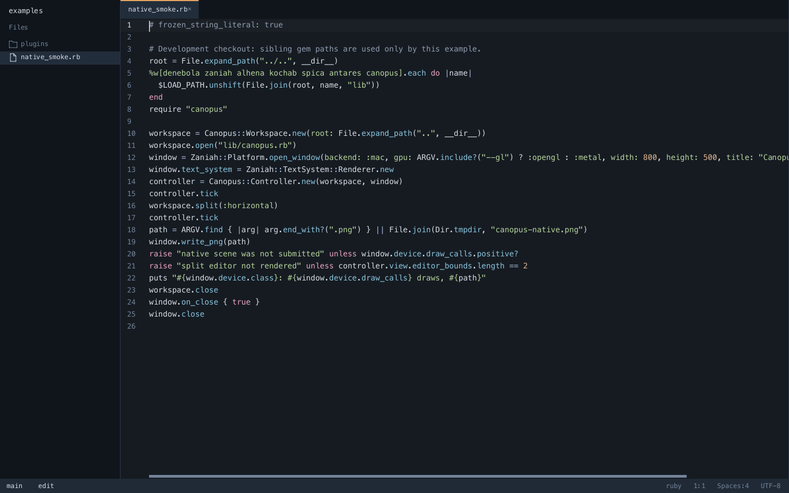

Canopus is a desktop code editor with a project explorer, integrated terminal,
Git tools, and optional language servers. Start here to open a file and save a
change; the chapters in the sidebar cover the next steps.



The screenshot is a headless rendering of the editor. The explorer is on the
left, open files appear as tabs above the editing area, and the status bar shows
the branch, language, cursor position, indentation, and encoding.

## Install Canopus

You need **CRuby 3.2 or newer**. Install the gem and check that the launcher is
available:

```sh
ruby --version
gem install canopus
canopus --version
```

Native windows need Ruby's `fiddle` component. Some Ruby distributions package
it separately. The launcher enables YJIT when your Ruby supports it.

| Platform | Native window requirements |
| --- | --- |
| macOS | Metal and a current CRuby installation; the system Ruby is usually too old. |
| Linux | Wayland/EGL/OpenGL or X11/GLX libraries, XKB, and `zenity` for file dialogs. |
| Windows | WGL; the integrated terminal uses ConPTY on 64-bit Windows. |

See [Platform setup](distribution.md) for desktop launchers and source-based
packages. Language servers and project tools are installed separately.

## Open your first project

From an existing project directory, run:

```sh
canopus --project .
```

The directory passed to `--project` must already exist. Without this option,
Canopus uses the current directory as the project root. To open a particular
file at startup, include its path:

```sh
canopus --project /path/to/project README.md
```

File paths are resolved relative to the project root. You can pass several:

```sh
canopus README.md lib/example.rb
```

For a terminal interface, use `canopus --tui --project .`. To export one editor
frame without opening a native window, use
`canopus --headless /tmp/canopus.png README.md`.

## Make a change and save it

1. Press **Cmd-P** on macOS or **Ctrl-P** on Linux and Windows.
2. Type part of a filename, select a match with the arrow keys, and press Enter.
3. Click in the editing area and change the text.
4. Press **Cmd-S** or **Ctrl-S** to save.
5. Press **Cmd-W** or **Ctrl-W** to close the tab. If it still has unsaved changes,
   choose Save, Discard, or Cancel in the prompt.

Create an untitled document with **Cmd-N** or **Ctrl-N**. Its first save asks for
a path. Automatic saving is off by default.

Use **Cmd-Z** or **Ctrl-Z** to undo, and **Cmd-Shift-Z** or **Ctrl-Shift-Z** to
redo. [Editing and navigation](usage.md) explains search, multiple cursors, panes,
and terminals.

## Find an action

Press **Cmd-Shift-P** or **Ctrl-Shift-P** to open the command palette. Type an
action's displayed title, use the arrow keys to select it, and press Enter.
Escape closes the palette.

Some actions display their command IDs, such as `settings.open`; others have
titles, such as **Stage File** (`git.stage`). This guide includes IDs so you can
identify actions and use them in custom key bindings.

Try `settings.open` to change project preferences, or **Run Task** to run a
configured project command. See [Settings and themes](configuration.md),
[Git workflow](git.md), and [Tasks](tasks.md) for walkthroughs.

## If something does not work

| Symptom | What to check |
| --- | --- |
| `canopus` is not found | Check the executable directory used by your Ruby gem installation and add it to your shell's `PATH`. |
| A native window cannot open | Check the platform libraries above and Ruby's `fiddle` component. Try `canopus --tui --project .` to use the terminal interface. |
| Typing does not insert text | If Vim mode is enabled, press `i` to enter Insert mode. See [Vim mode](vim.md). |
| Completion or definition lookup is missing | Install the relevant server, check its command, and follow [Language servers](lsp.md). |
| A settings change is ignored | Check the message/status area and the Problems panel for invalid JSONC or values. Higher-priority layers may also override the value. |
| A save reports that the file changed on disk | Unsaved edits are preserved. Review the external change before deciding how to save; do not assume the external version was overwritten. |

If Canopus offers to recover unsaved changes after an interrupted session,
choose **Restore** and save the recovered files. Recovery skips drafts larger
than 10 MiB and snapshots above its 64 MiB budget; save large edits regularly.
Files of 100 MiB or more open read-only.

Run `canopus --help` for launcher options. [Performance and recovery](performance.md)
explains local profiling and crash reports for problems you need to investigate.
